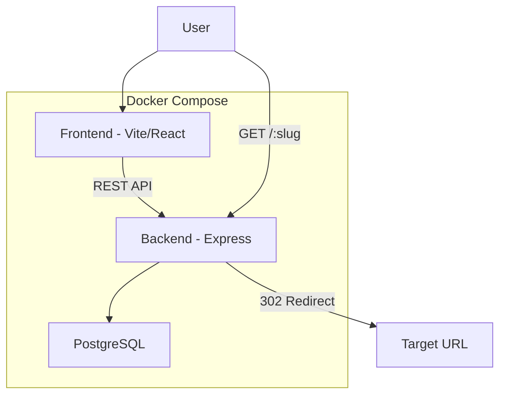

# URL Shortener with Click Analytics

## Architecture Overview




## Monorepo Structure

```
pebblepost/
  docker-compose.yml
  README.md
  backend/
    src/
      index.ts                  # Express app entry
      routes/
        links.ts                # POST/GET /api/v1/links
        analytics.ts            # GET /api/v1/links/:id/analytics
        redirect.ts             # GET /:slug (302 redirect)
      middleware/
        error-handler.ts        # Global error handler
        validate.ts             # Zod validation middleware
      services/
        link.service.ts         # Link creation, lookup, expiration logic
        analytics.service.ts    # Click recording, aggregation, UA parsing
      schemas/
        link.schema.ts          # Zod schemas for link endpoints
        analytics.schema.ts     # Zod schemas for analytics endpoints
      lib/
        slug.ts                 # Slug generation (nanoid, 8 chars, lowercase alphanumeric)
        ua-parser.ts            # Thin wrapper around ua-parser-js
    prisma/
      schema.prisma
      migrations/
      seed.ts                   # 3-5 links, ~50 click events
    vitest.config.ts
    tests/
      redirect.test.ts          # Redirect behavior + 404 for missing/expired slugs
      analytics.test.ts         # Daily aggregation correctness
  frontend/
    src/
      pages/
        LinksPage.tsx           # List links + create form
        LinkDetailPage.tsx      # Analytics for a single link
      components/
        CreateLinkForm.tsx      # Form with URL + optional slug + optional expiration
        LinksTable.tsx          # Table of all links
        ClicksChart.tsx         # Recharts daily clicks bar/line chart
        AnalyticsSummary.tsx    # Total clicks, top browsers, date range picker
      api/
        client.ts               # Fetch wrapper for /api/v1
      App.tsx
      main.tsx
```

## Database Schema (Prisma)

Two tables: `Link` and `ClickEvent`.

```prisma
model Link {
  id          String       @id @default(uuid())
  slug        String       @unique              // citext or LOWER() unique index
  targetUrl   String
  expiresAt   DateTime?
  createdAt   DateTime     @default(now())
  clicks      ClickEvent[]
}

model ClickEvent {
  id        String   @id @default(uuid())
  linkId    String
  link      Link     @relation(fields: [linkId], references: [id])
  timestamp DateTime @default(now())
  userAgent String?
  browser   String?
  os        String?
  device    String?
}
```

- Slug uniqueness enforced at DB level. Slug stored lowercase.
- `ClickEvent.timestamp` indexed for efficient daily aggregation.
- `Link.expiresAt` nullable; null means no expiration.

## API Endpoints

All under `/api/v1` except the redirect route.


| Route                             | Method | Description                                                                                                    |
| --------------------------------- | ------ | -------------------------------------------------------------------------------------------------------------- |
| `POST /api/v1/links`              | POST   | Create a short link. Body: `{ url, slug?, expiresAt? }`. Returns the created link.                             |
| `GET /api/v1/links`               | GET    | List all links (paginated).                                                                                    |
| `GET /api/v1/links/:id/analytics` | GET    | Total clicks, daily breakdown, browser/OS/device breakdown. Query: `?range=7d                                  |
| `GET /:slug`                      | GET    | 302 redirect to target URL. Records click event asynchronously. Returns 404 if slug not found or link expired. |


### Response Shape (consistent across endpoints)

```typescript
// Success
{ data: T }

// Error
{ error: { code: string, message: string } }
```

### Validation (Zod)

- `POST /api/v1/links`: `url` must be a valid HTTP/HTTPS URL. `slug` (optional) must be 3-30 chars, lowercase alphanumeric + hyphens, no leading/trailing/consecutive hyphens. `expiresAt` (optional) must be a future ISO date.
- `GET /api/v1/links/:id/analytics`: `range` must be one of `7d`, `30d`, `90d`. Default: `30d`.

## Key Implementation Details

### Slug Generation

- Use `nanoid` with a custom lowercase alphanumeric alphabet (36 chars), 8-character length.
- On collision (unique constraint violation), retry up to 3 times with a new slug.

### Click Recording

- When a redirect occurs, record the click event **after** sending the 302 response (fire-and-forget `Promise`) so the user isn't blocked.
- Parse `User-Agent` using `ua-parser-js` to extract browser, OS, and device type.

### Analytics Aggregation

- Daily clicks: `GROUP BY DATE(timestamp)` filtered by the selected range.
- Browser/OS/device breakdown: `GROUP BY browser` (or os/device) with count, filtered by range.
- Return both in a single response to minimize round trips.

### Link Expiration

- On redirect, check `expiresAt`. If expired, return 404 with a message indicating the link has expired.
- Expired links still appear in the links list but are visually marked as expired.

### Performance Considerations (documented in README)

- Index on `ClickEvent.timestamp` for efficient date-range queries.
- Index on `Link.slug` (unique) for O(1) redirect lookups.
- Fire-and-forget click recording to keep redirect latency low.
- README will note: at scale, click recording would move to a queue (e.g., Kafka) and analytics would use materialized views or a time-series DB.

## Frontend Pages

### Links Page (`/`)

- Table of all links showing: short URL, target URL, created date, expiration status, total clicks.
- "Create Link" form above or in a modal: URL input, optional custom slug, optional expiration date picker.
- Validation feedback inline (Zod on client too, or simple form validation).
- Empty state when no links exist.

### Link Detail Page (`/links/:id`)

- Summary: short URL, target URL, total clicks, created/expires dates.
- Date range selector: 7d / 30d / 90d buttons.
- Recharts bar chart of clicks per day.
- Simple table or list of browser/OS breakdown.

## Testing Strategy

Using Vitest with `supertest` for API integration tests.

- `**redirect.test.ts`**: Redirect returns 302 with correct `Location` header; 404 for unknown slug; 404 for expired link; click event is recorded after redirect.
- `**analytics.test.ts`**: Daily aggregation returns correct counts; range filtering works; empty range returns empty array.

## Docker Compose

- `postgres`: Official Postgres image, port 5432, with a named volume for persistence.
- `backend`: Node.js container, runs Prisma migrations + seed on startup, then starts Express on port 3000.
- `frontend`: Node.js container, runs Vite dev server on port 5173 with proxy to backend.
- Single `docker compose up` brings everything up.

## README Contents

- Architecture diagram (Mermaid)
- How to run (`docker compose up`)
- Tech stack justification (TypeScript for type safety across stack, Express for familiarity, Prisma for type-safe DB access, Vite for fast DX)
- Design decisions: case-insensitive slugs, 302 redirects, fire-and-forget click recording, UA parsing
- Intentional simplifications: no auth, create + read only (no update/delete), no rate limiting
- Scaling notes: queue-based click ingestion, materialized views, CDN for redirects
- LLM prompts used

